# Walking Robot

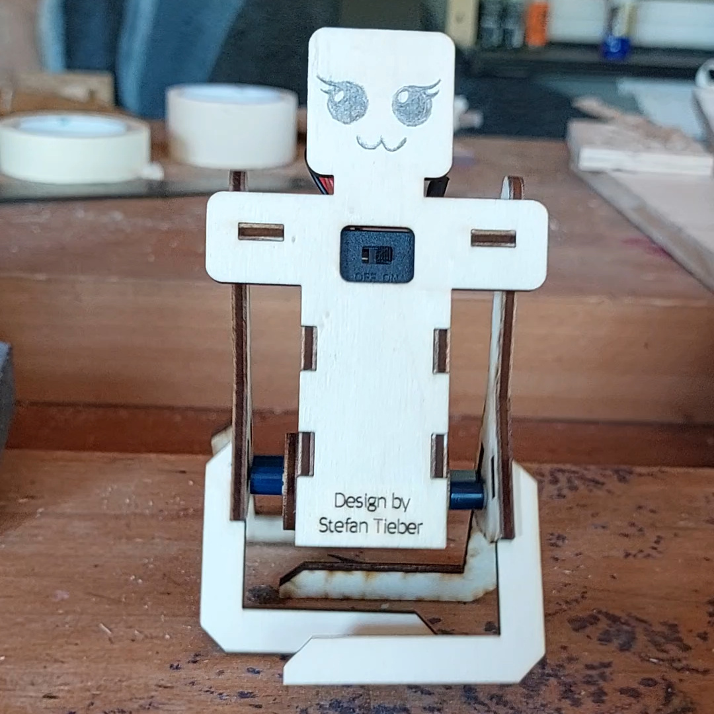

This repo is for everyone who saw this [reel](https://www.instagram.com/reel/DRvOFXEjLOG/) and asked me if they could have the design files too.

## Laser
You can download [roboter8.svg](./roboter8.svg) and use a CO₂ laser to cut 4mm plywood, which in my experience in reality is more like 3.6mm.
Depending on your wood and your laser, you might need to change the SVG slightly. I recommend Inkscape for this purpose.

## Parts
I used this [Lego-compatible Motor](https://www.aliexpress.com/item/1005008158660227.html):  
The color matters, as they have different speeds.

And this [battery box](https://www.aliexpress.com/item/1005003678685702.html):

As crank shafts and for the assembly I used these Lego parts:

  
- 2x 6279875
- 2x 6013938
- 2x 6344867 (40147 for other colors)
- 2x 4211815
- 2x 4211807

I bought them from the [official website](https://www.lego.com/pick-and-build/pick-a-brick).

## Assembly:

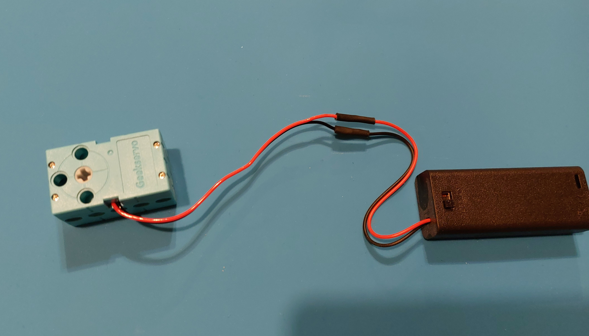  
Solder the cables of the motor and the battery box and seal them using heat shrink or tape.

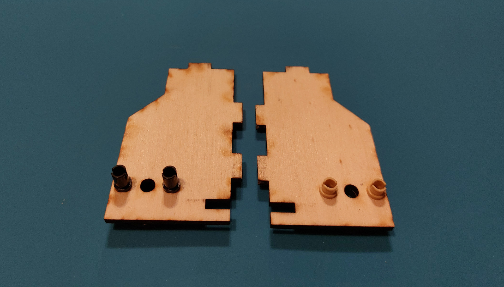  
Insert the pegs. Because the motor is asymmetric, you have to do it exactly as on the picture.

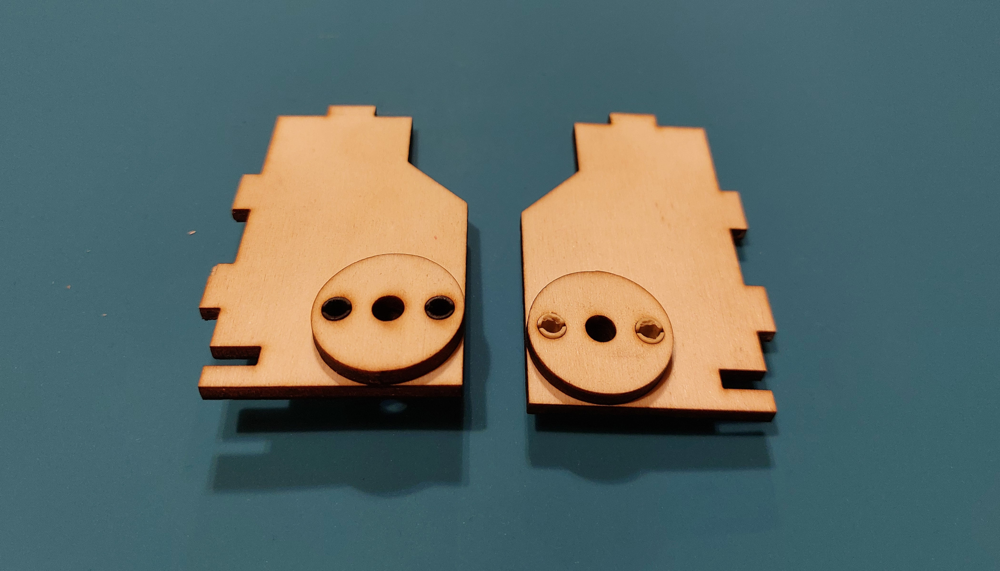  
Flip the parts and add the round spacers.

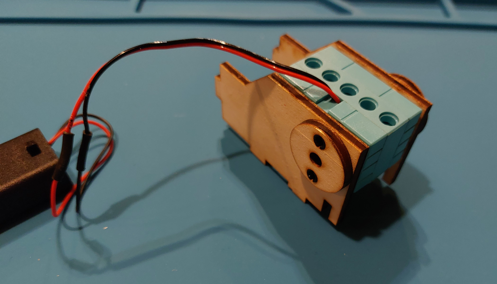  
Add the parts to the motor. The cable must be in the back, otherwise your robot will walk backwards.

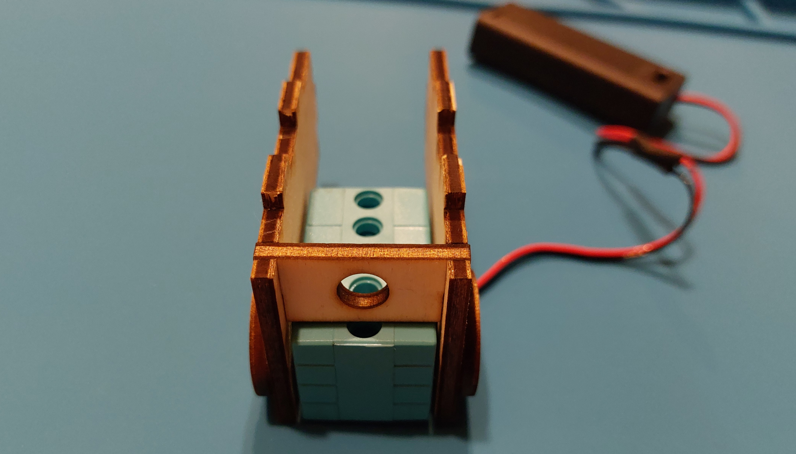  
Add the small part at the bottom.

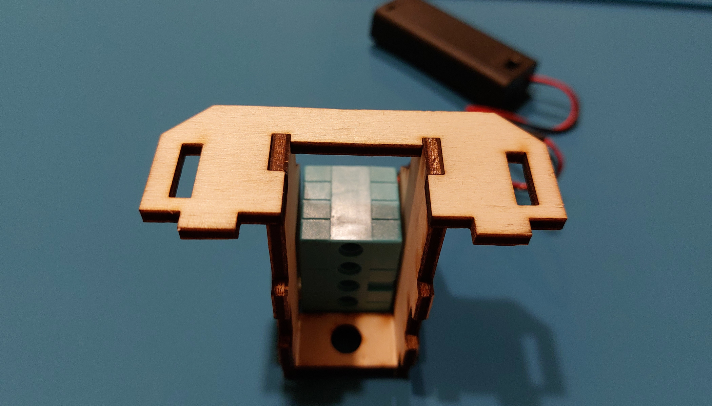  
Add the shoulders.

  
Draw your face.

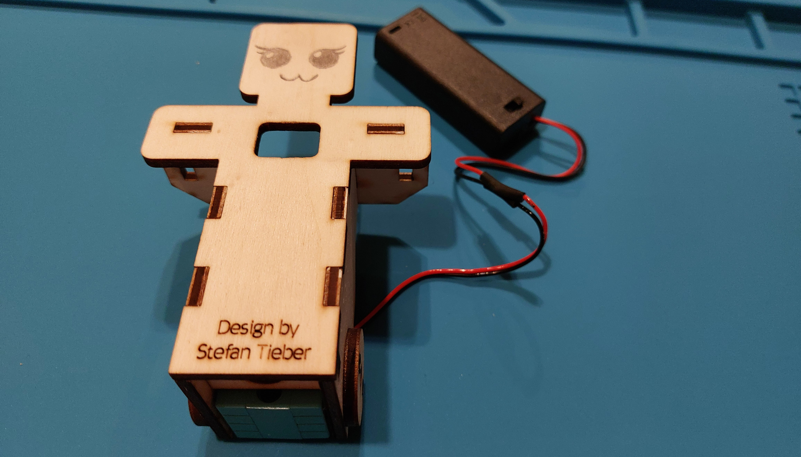  
Add the front to the robot.

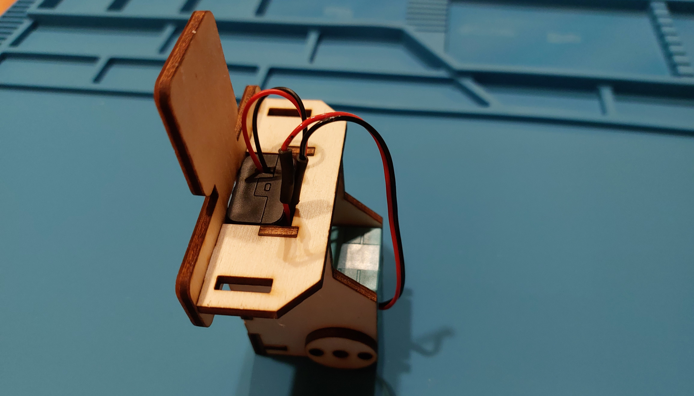  
Put batteries in the box and put the battery box in the robot.

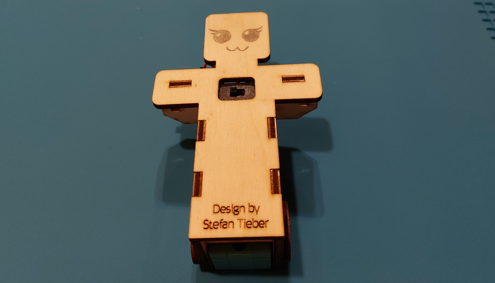  
Make sure the switch is accessible.

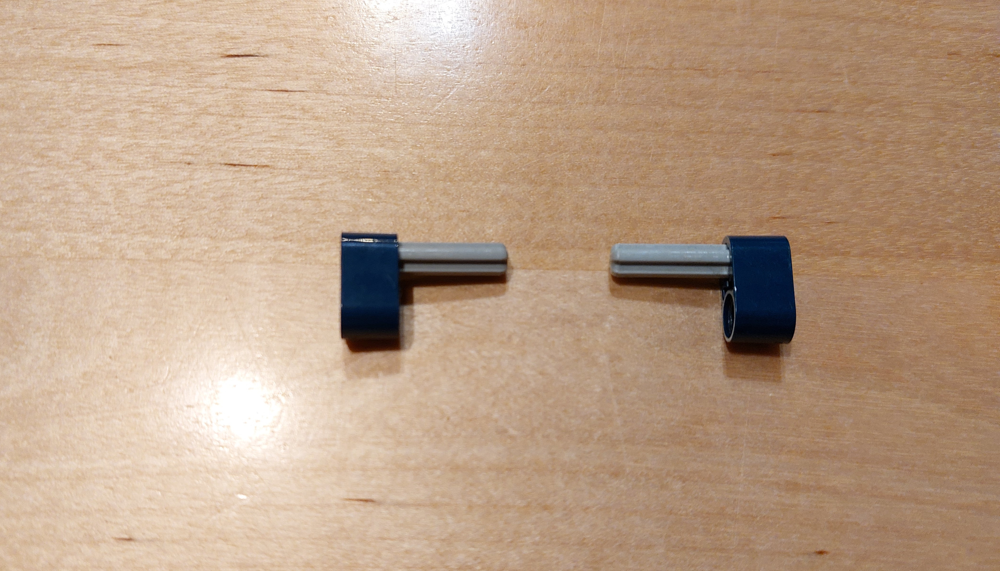  
Assemble the crank shafts.

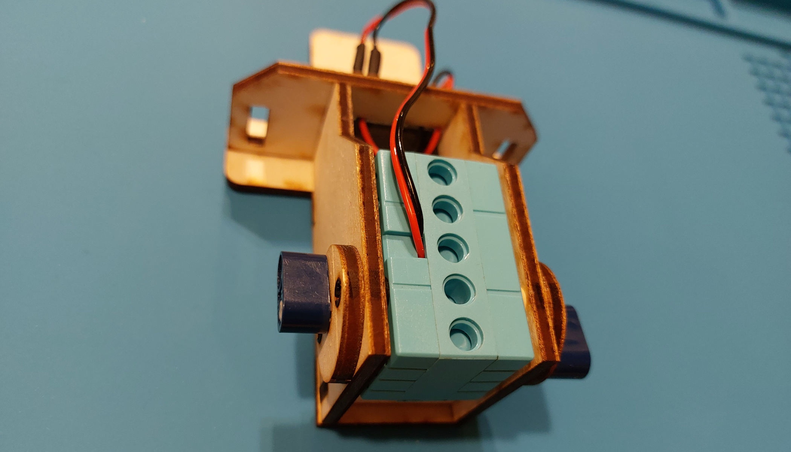  
Add them to the robot. Make sure they are offset by 180°.

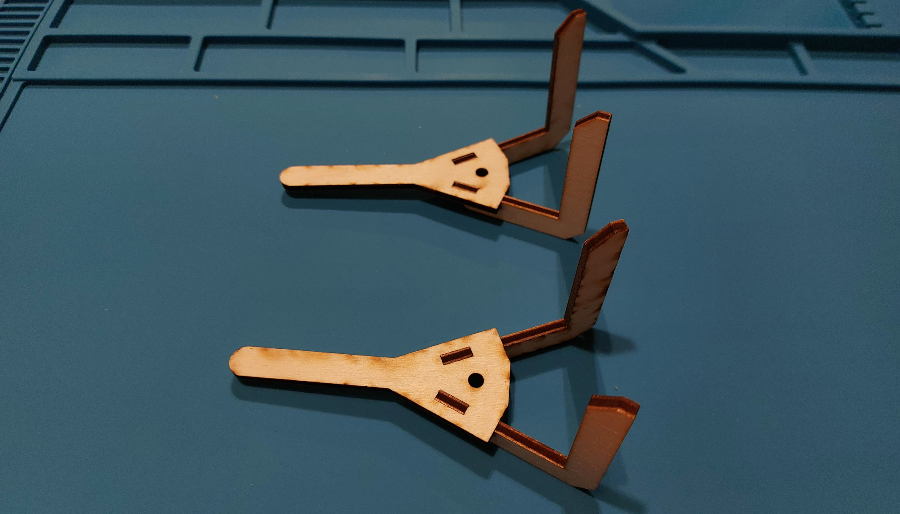  
Assemble the legs. This might be a bit harder than the rest, as they carry the weight and must not come apart.

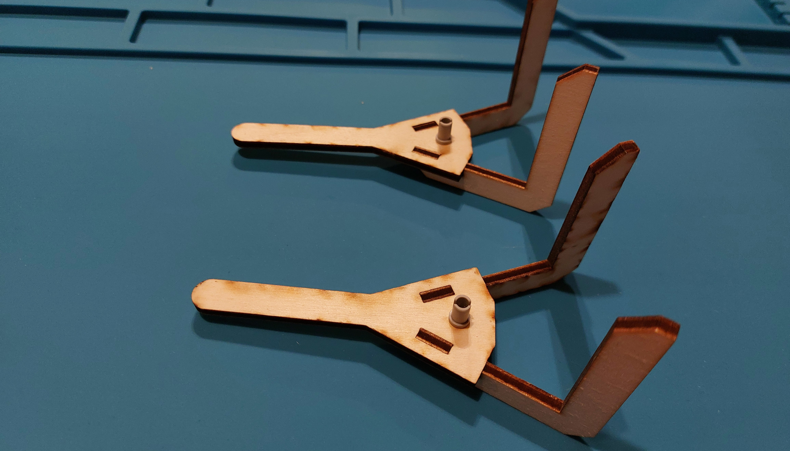  
Add the gray pegs to the legs.

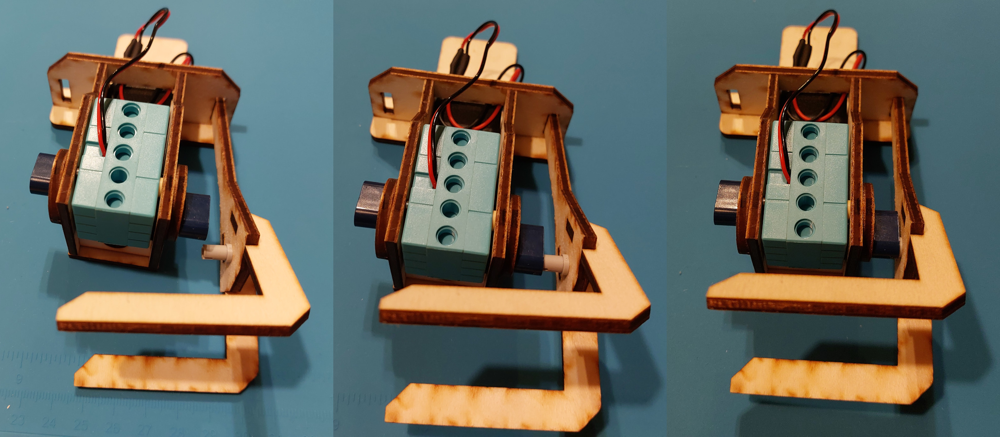  
Add the legs to the robot like this.

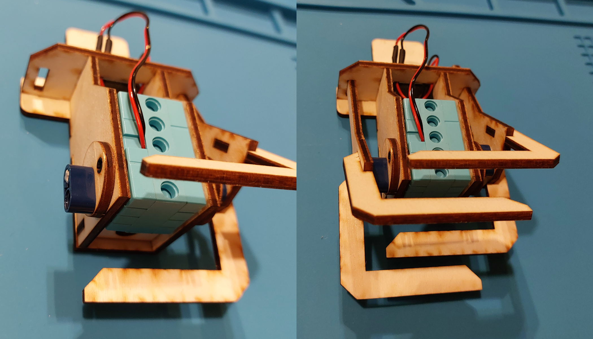  
Sometimes it helps to turn the crank shaft down first and then add the leg.

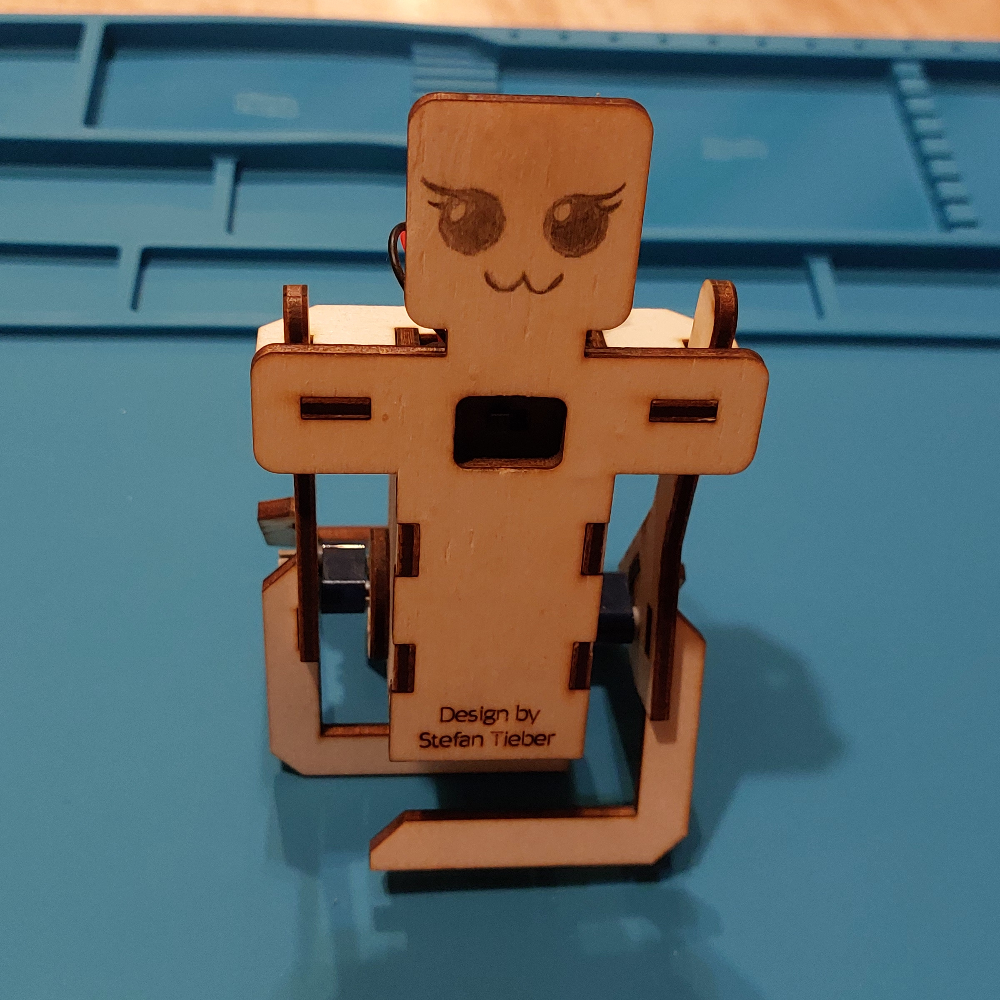  
That's it! I hope it works for you :)
